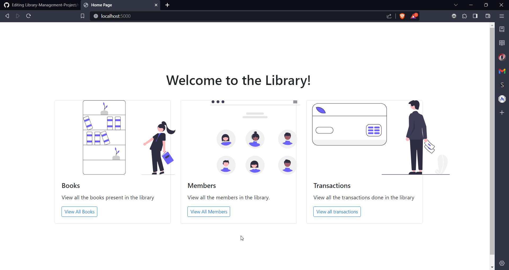
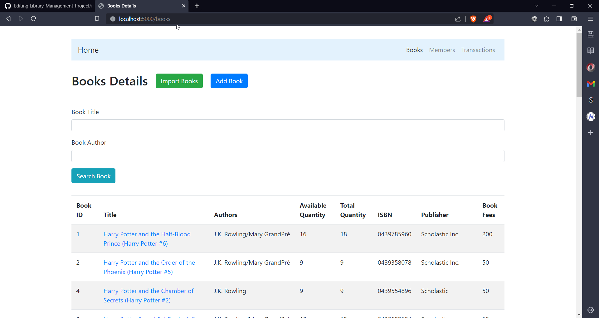
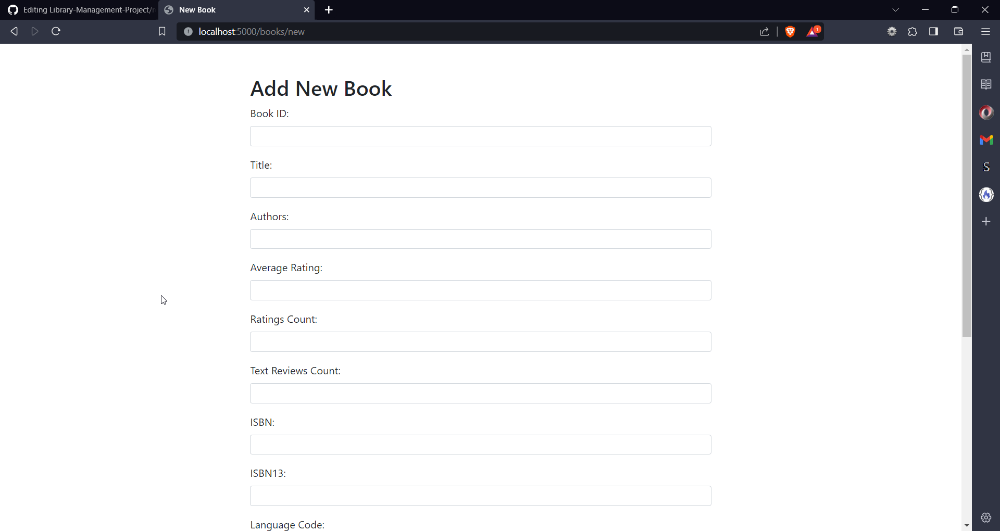
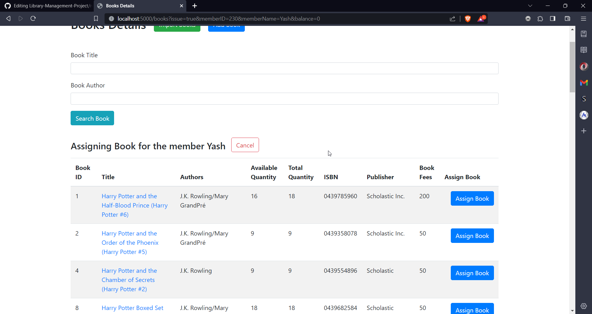
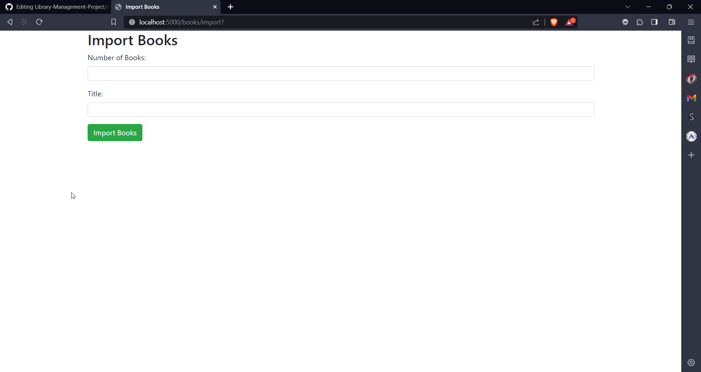
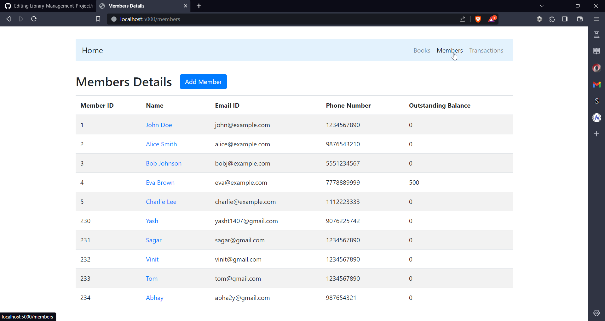
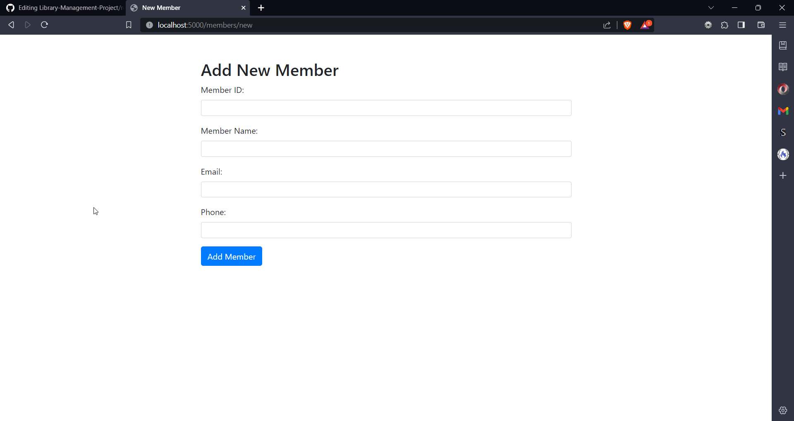
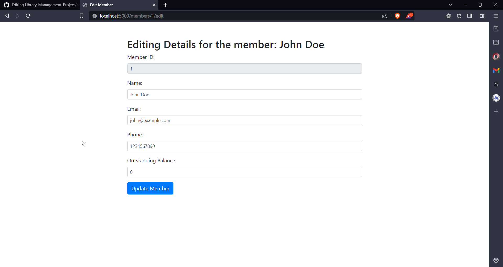
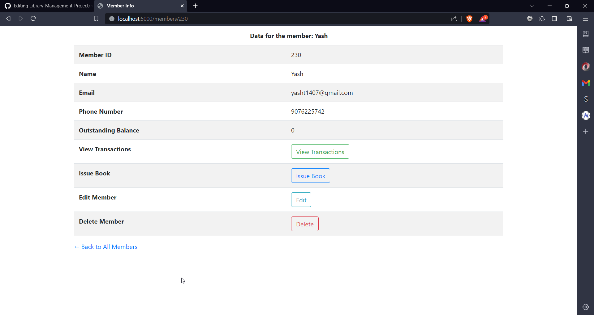
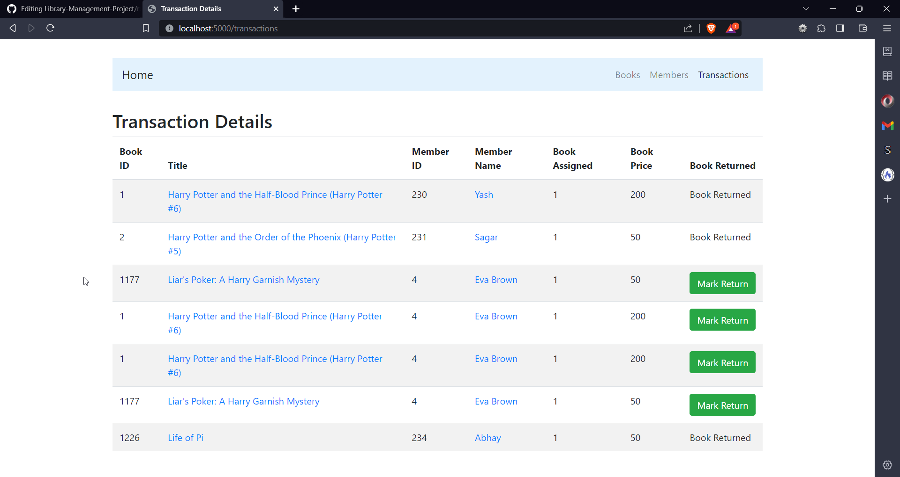

# Library Management Project

### Introduction
- The given project is a library management project.
- It has three main parts : Members, Books and Transactions.
- The following are the usage points.
    1. Perform general CRUD operations on Books and Members.
    2. Issue a book to a member
    3. Issue a book return from a member and charge rent fee on it.
    4. Search for a book by name and author
    5. Make sure a member's outstanding debt is not more than 500.
    6. Additionally, import data from an external API.
- All the above mentioned points are executed in this application.

### Output

#### Home Page

#### Books Page

#### Books Search

#### Add Book

#### Edit Book

#### View Book Info

#### Issue a Book

#### Import Books

#### View All Members

#### Add Member

##### Edit Member

#### View Member Info

#### View Transactions
