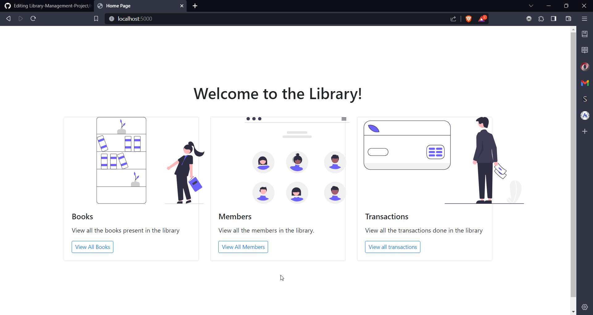
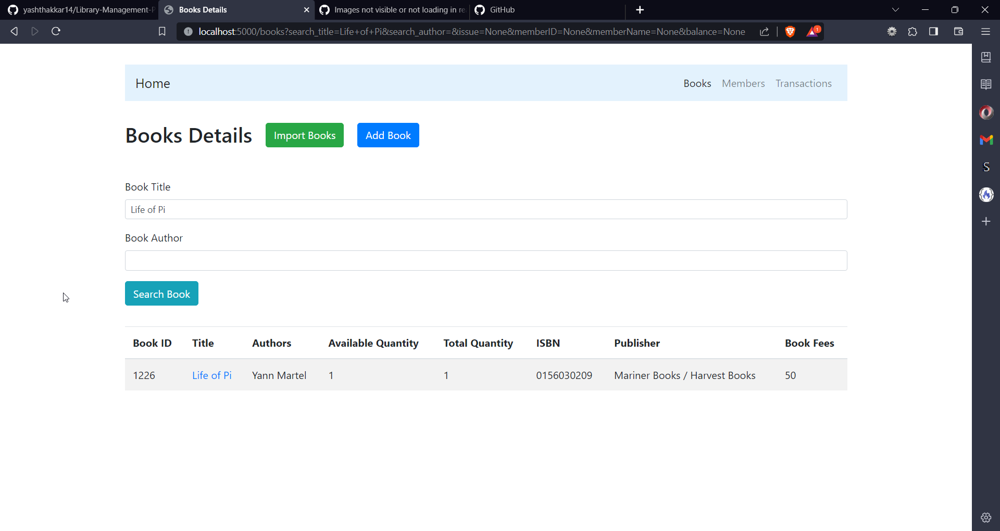
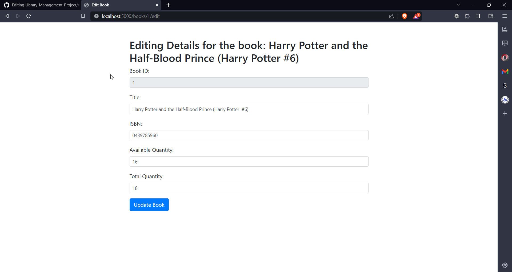
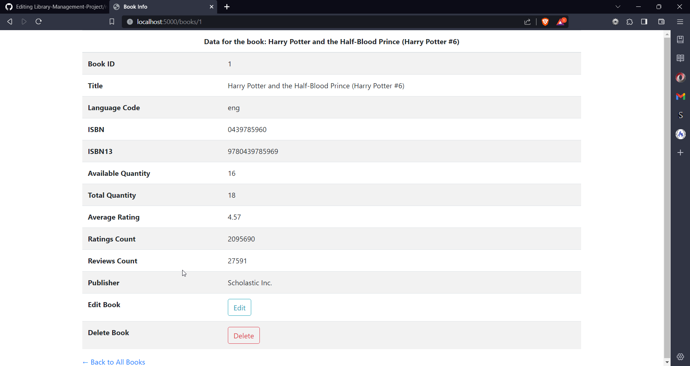
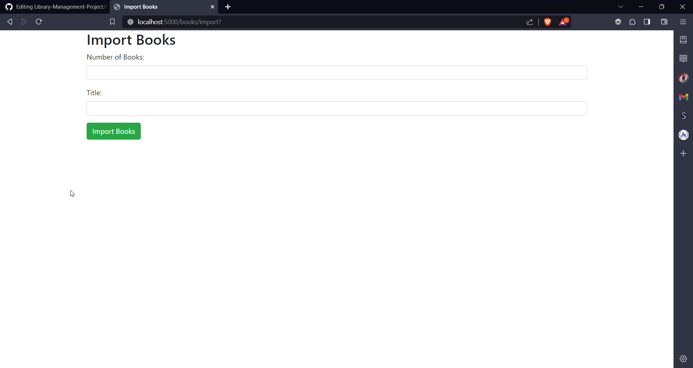
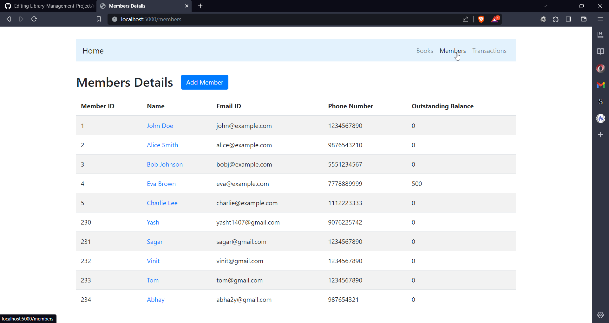
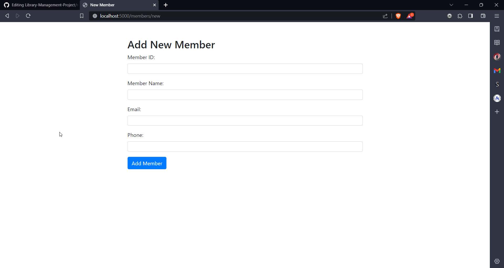
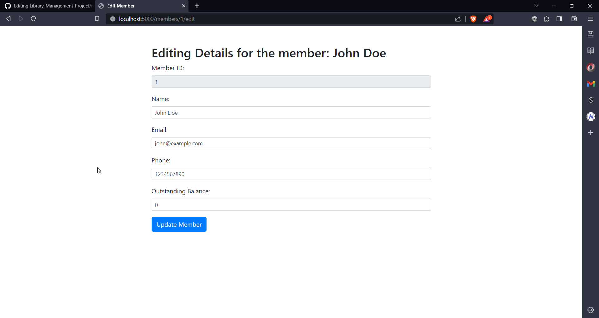
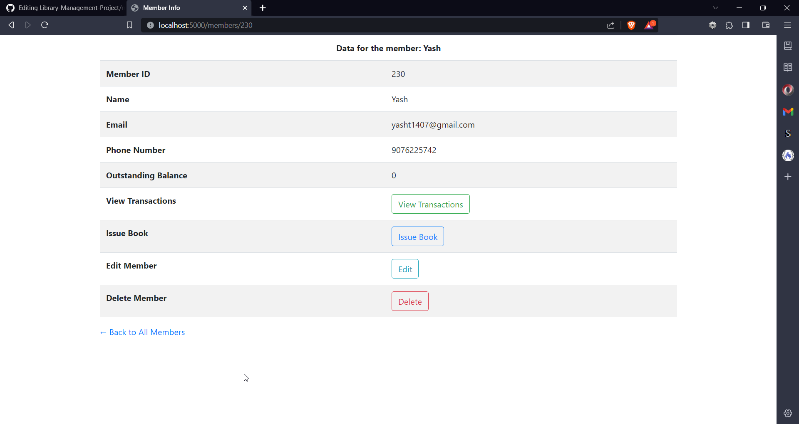
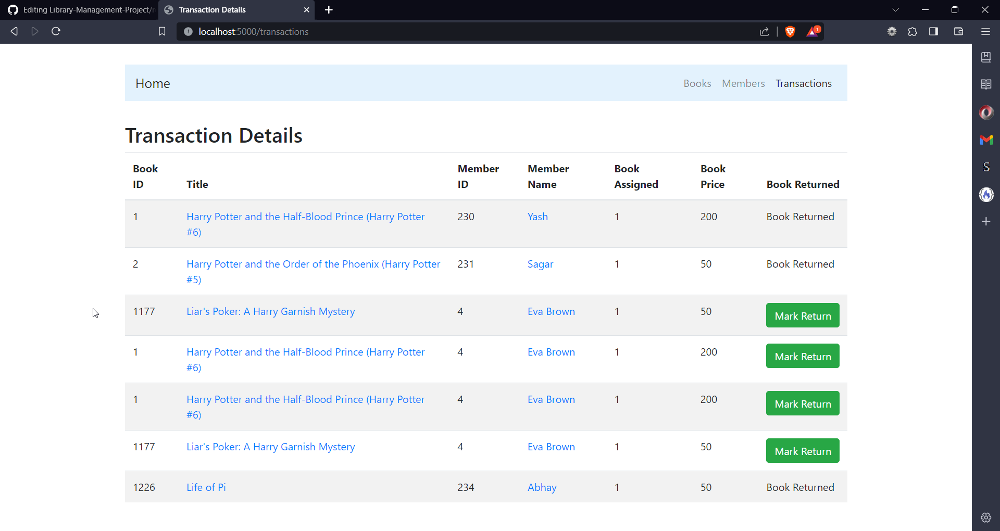

# Library Management Project

### Introduction
- **NEW** : Check the assets folder for the mysql dump file
    1. Login to your SQL using the command: `mysql -u username -p`
    2. Use the Database :  `USE library_management;`
    3. Import the database file : `source 'library_management.sql';`
    4. Exit : exit;
- The given project is a library management project.
- It has three main parts : Members, Books and Transactions.
- The following are the usage points.
    1. Perform general CRUD operations on Books and Members.
    2. Issue a book to a member
    3. Issue a book return from a member and charge rent fee on it.
    4. Search for a book by name and author
    5. Make sure a member's outstanding debt is not more than 500.
    6. Additionally, import data from an external API.
- All the above mentioned points are executed in this application.
- Run the application using `python app.py`

### Output

#### Home Page

#### Books Page

#### Books Search

#### Add Book

#### Edit Book

#### View Book Info

#### Issue a Book

#### Import Books

#### View All Members

#### Add Member

##### Edit Member

#### View Member Info

#### View Transactions
